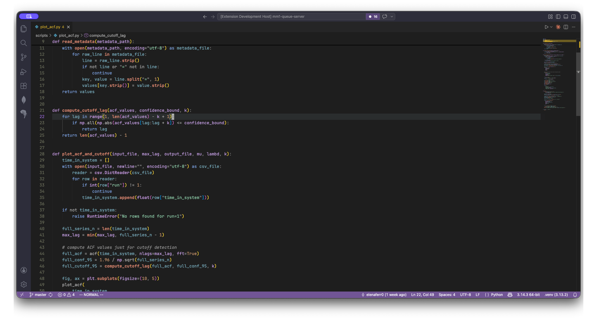

# Quiet Pastel Dark

A dark theme with a pastel palette — soft purples, muted blues, and sage greens. Based on Quiet Light.



## Colors

| Token | Color |
|---|---|
| Keywords | blue `#7B9FE0` |
| Types / Classes | purple `#B68FD4` |
| Parameters | light purple `#C4A0E8` |
| Local variables | steel blue `#7AACBE` |
| Properties | sage green `#8BC4A0` |
| Functions | orange `#D4836B` |
| Strings / Comments | pastel green `#8BC4A0` |
| Numbers / Constants | warm orange `#C8956A` |

## Install

Copy to your extensions folder and restart VS Code:

```bash
cp -r . ~/.vscode/extensions/quiet-pastel-dark-0.0.1
```

Then open the command palette → **Preferences: Color Theme** → **Quiet Pastel Dark**.
